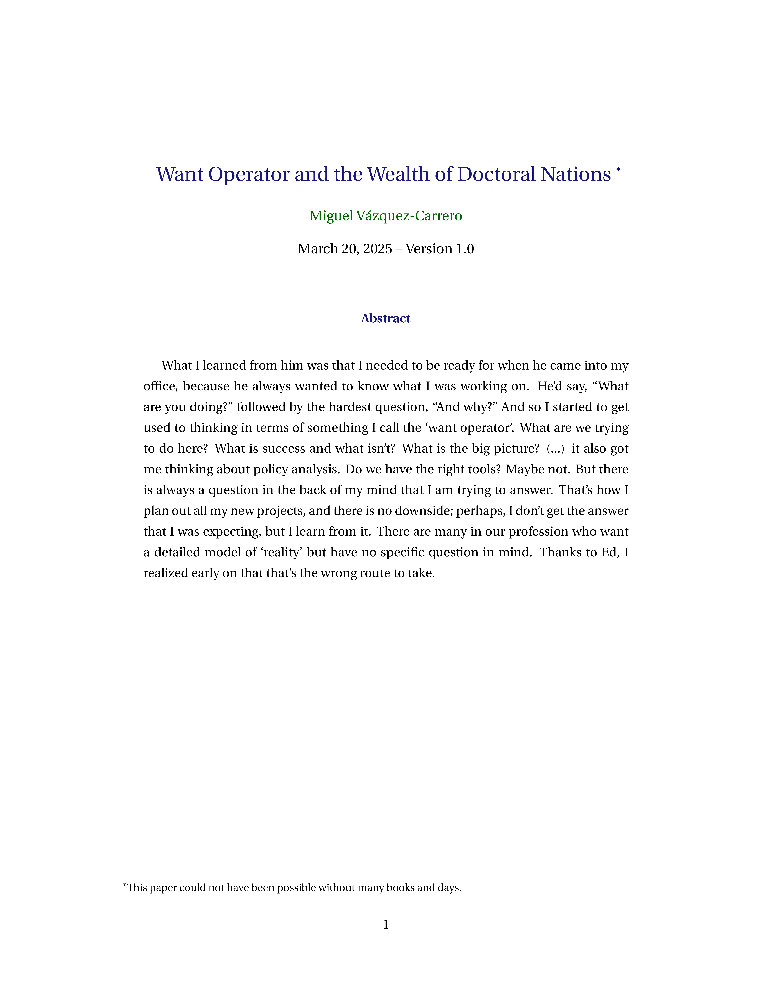
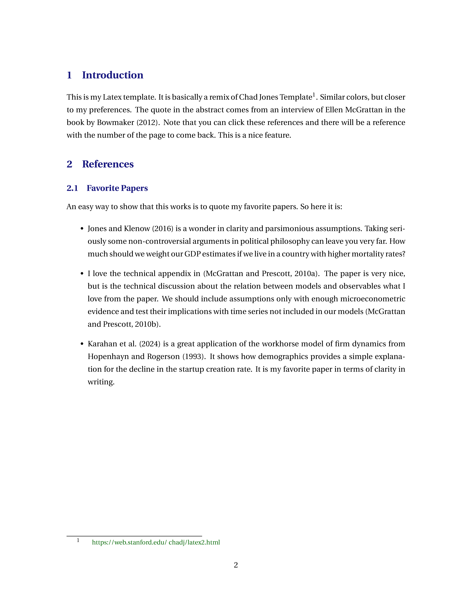
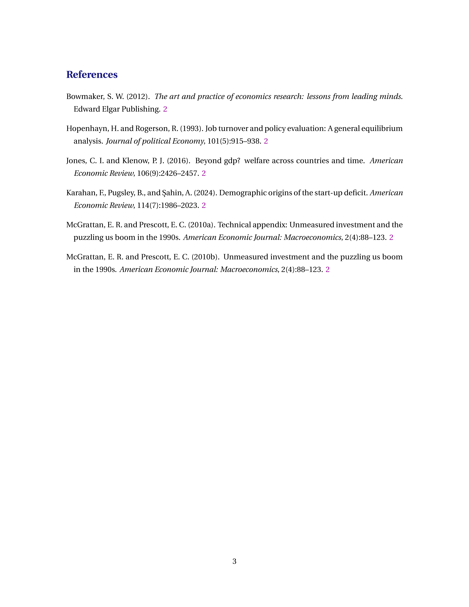
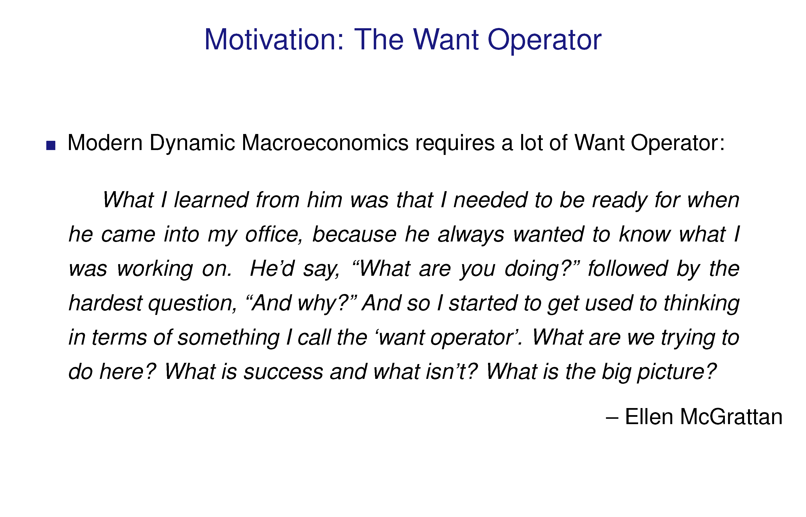
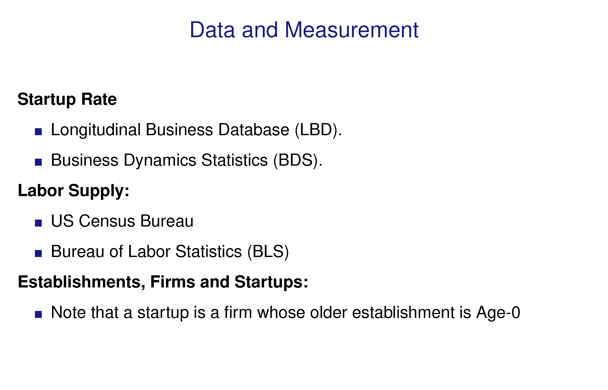
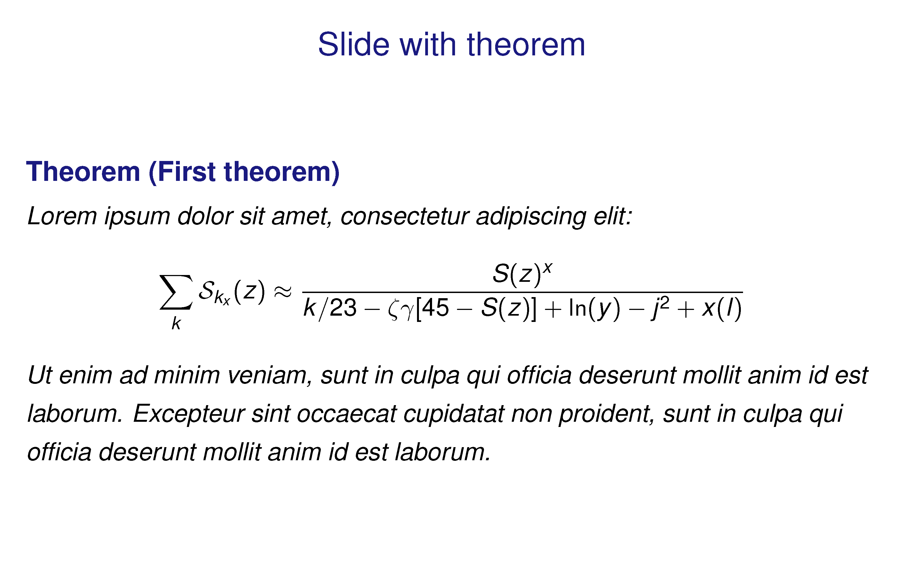

# LaTeX Templates

This repository contains two LaTeX templates:

1. **Paper Template**  
   - File: `paper-template.tex` (with an example output in `paper-template.pdf`)
   - Intended for papers.

2. **Slides Template**  
   - File: `slides-template.tex` (with an example output in `slides-template.pdf`)
   - Intended for presentation slides.

Both templates are meant to quickly create a minimal and consistent look for my paper and slide presentations.

I included each template in a `.zip` to keep them separated from the examples.

Feel free to use and share in any way.

**Acknowledgments:**  
Shout out to [Chad Jones](https://web.stanford.edu/~chadj/latex2.html) and [Pascal Michaillat](https://pascalmichaillat.org/d1/) for freely sharing their LaTeX templates —the style and structure of these templates are basically tweaked versions of theirs, with my own preferences.

## Paper Template

<!-- Paper Template -->

  
  
  

## Slides Template

<!-- Slides Template -->
<!-- 2×2 layout -->
<!-- Top row -->

  
  

<!-- Bottom row -->

  
  

